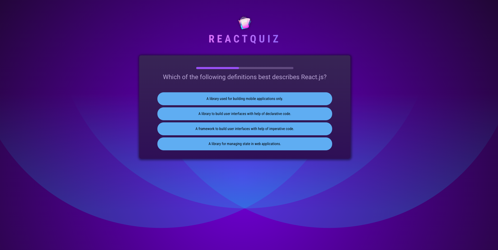
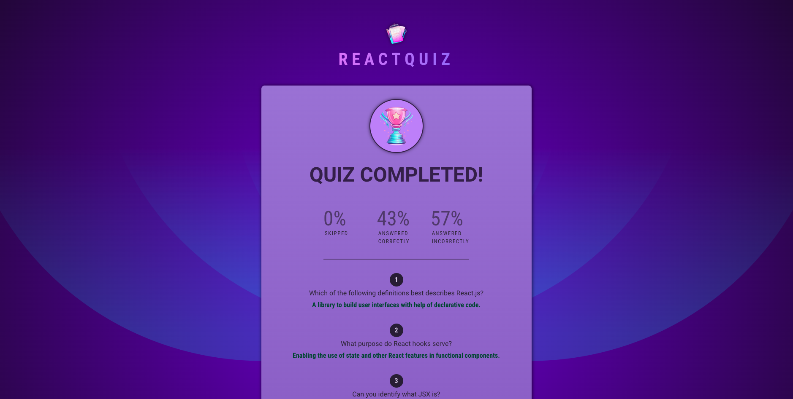

# React Simple Investment Calculator

An interactive single-page React application for taking quizzes with dynamically shuffled answers and real-time feedback. This project showcases React fundamentals, including component-based architecture, state management, and dynamic rendering.


<p align="center">
  
</p>
<p align="center">
  
</p>

## Features
- Displays questions and shuffles answers to create a unique experience every time the quiz is started.
- Provides immediate feedback on whether selected answers are correct or incorrect.
- Includes a summary screen at the end of the quiz to showcase results and overall performance.
- Tracks the current question, user answers, and correctness seamlessly to ensure a smooth user experience.

## Installation
To run the project locally:

1. Clone the repository:
   ```
   git clone https://github.com/Houdalar/React-Quizz-App.git
   ```
2. Navigate to the project directory:
   ```
   cd React-Quizz-App
   ```
3. Install dependencies:
   ```
   npm install
   ```
4. Start the application:
   ```
   npm start
   ```